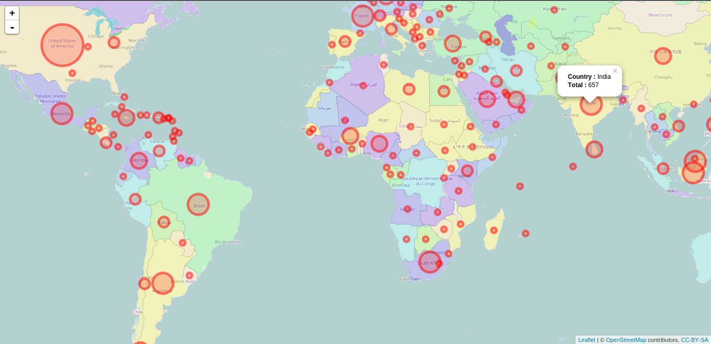
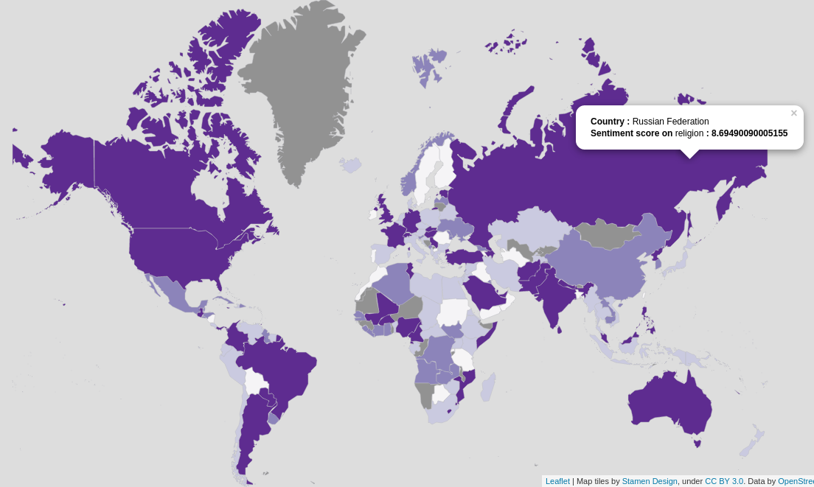

# Glob_Analytics

Global Analytics is a system which crawls tweets from [Twitter](www.twitter.com) API, resolving location of tweets which are not geo-tagged using different [Geocoding](http://en.wikipedia.org/wiki/Geocoding) Map API, translate into english, correctify improper words of tweets and then analyzes the sentiment around a targeted topic (here i.e Governance, Economics, Religion, Tourism) using [NLTK](http://www.nltk.org/) techniques with the help of [TextBlob](textblob.readthedocs.org) and generates the Visual Statistics on different Visualization techniques eg: Map, Histogram etc. 

Steps involved here for creating analytics:
  - Crawling Twitter Data (Twitter API)
  - Storing Twitter Data (MongoDB)
  - Filter Data (location, text, geo-spatial details)
  - Resolving Location (Geocoding Map API)
  - Preparing Data (Cleaning tweets ie, urls, @user, unicode, Spell correction)
  - Scoring Country (Sentimentally)
  - Visualization on OpenStreet Map
  

## Installation
1. Tweepy
2. Pymongo
3. Textblob
4. MongoDB
5. Python 2.7+
6. RStudio

## Instructions

##### Fork the repo into your account...

Use `git clone` to your local machine:
```sh
git clone https://github.com/sunnykrGupta/Glob_Analytics.git
```

> Install all dependencies defined in `requirements.txt` :

```sh
$ pip install -r requirements.txt
```


##### Follow this link to set MongoDB for the first time : [Detailed Installation Instruction MongoDB](http://docs.mongodb.org/manual/installation/ )

##### After this Install Rstudio for Visualization written in R :

> Install the r programming language by following instructions: 
```sh
# Install R
$ sudo add-apt-repository "deb http://cran.rstudio.com/bin/linux/ubuntu $(lsb_release -cs)/"
$ sudo apt-key adv --keyserver keyserver.ubuntu.com --recv-keys E084DAB9 
$ sudo apt-get update
$ sudo apt-get install r-base r-base-dev
```

##### Next, Download the required package according to your Operating System. [Download RStudio](http://www.rstudio.com/products/rstudio/download)

Once you have Rstudio up and running, Follow packages or libraries below that are needed for the visualization before running the R-script in your machine:
```
> install.packages('rgdal')
> install.packages('RColorBrewer')
> install.packages('reshape2')
> install.packages('maps')
```
This command will install Leaflet in R that is ultimate boss of Map-VIZ. For the installation of the package “leaflet” one should have “devtools” package in your R-studio, following command will take care of that : 
```
> if (!require('devtools')) install.packages('devtools')
> devtools::install_github('rstudio/leaflet')
```
After the installation of these packages you are ready to visualize yourself the plotting of 
the tweets, choropleth and graphical experience of the tweets.


## Visualization

Density of Tweets across world wide



Choropleth



## Developer
1. [Sunny Kumar](https://in.linkedin.com/in/sunnykrgupta)
2. [Prateek Sharma](https://www.facebook.com/prateek.sharma.10048)
